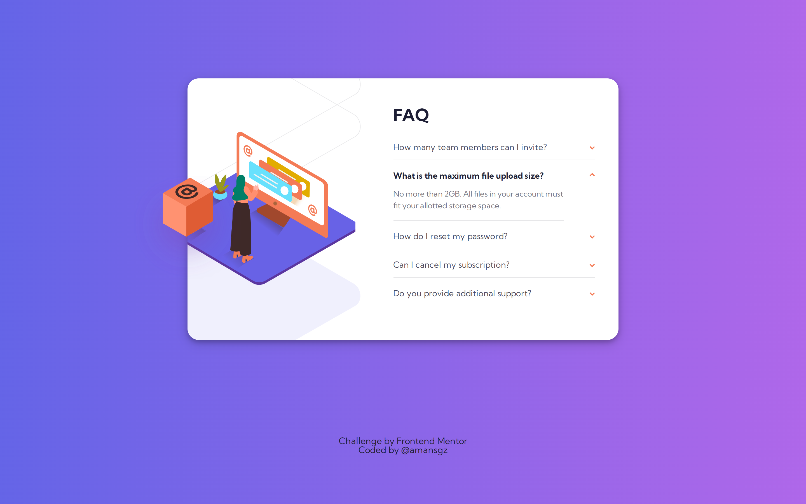

# 👩‍💻 FAQ accordion card

## The challenge

The challenge is to build out this FAQ accordion card and get it looking as close to the design as possible.

Users should be able to:

- View the optimal layout for the component depending on their device's screen size
- See hover states for all interactive elements on the page
- Hide/Show the answer to a question when the question is clicked

## Built with

- Semantic HTML5 markup
- SCSS 
- Mobile-first workflow

  <h3>
    <a href= "https://scss-faq-accordion-card.netlify.app/">
      Live site
    </a>
     | 
    <a href= "https://www.frontendmentor.io/challenges/faq-accordion-card-XlyjD0Oam">
      Challenge
    </a>
  </h3>

This application/site was created as a submission to <a href= "https://www.frontendmentor.io/">Frontend Mentor Challenges</a> 
