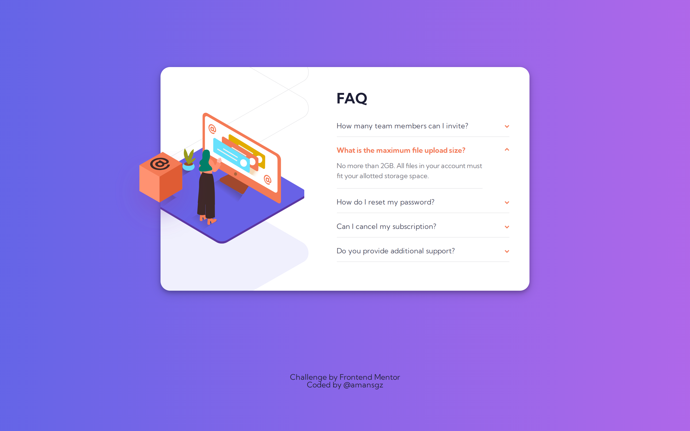

# 👩‍💻 Frontend Mentor - FAQ accordion card

[Frontend Mentor challenges](https://www.frontendmentor.io/) help you improve your coding skills by building realistic projects.

This is a solution for [Faq Accordion Card](https://www.frontendmentor.io/challenges/faq-accordion-card-XlyjD0Oam) challenge.

## The challenge

The challenge is to build out this FAQ accordion card and get it looking as close to the design as possible.

Users should be able to:

- View the optimal layout for the component depending on their device's screen size
- See hover states for all interactive elements on the page
- Hide/Show the answer to a question when the question is clicked

## Built with

- Semantic HTML5 markup
- SCSS 
- Mobile-first workflow

## Live site solution

[Live site](https://scss-faq-accordion-card.netlify.app/) deployed with Netlify.

## Author

- Frontend Mentor - [@amansgz](https://www.frontendmentor.io/profile/amansgz)